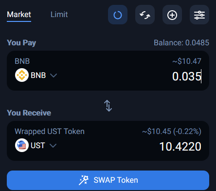
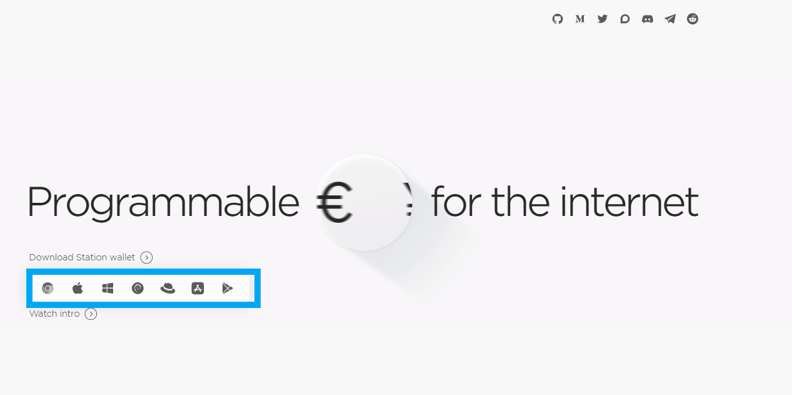
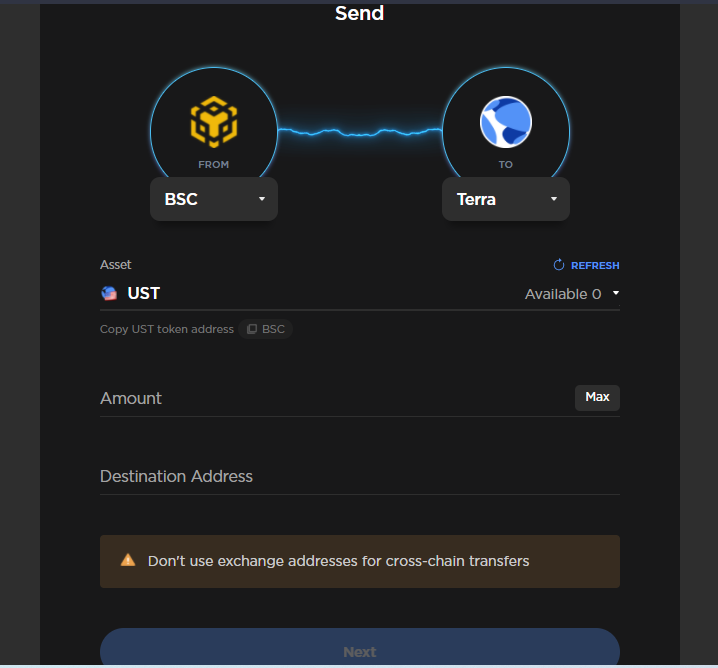
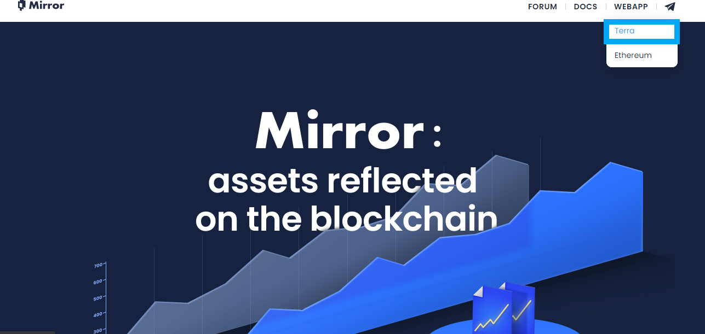
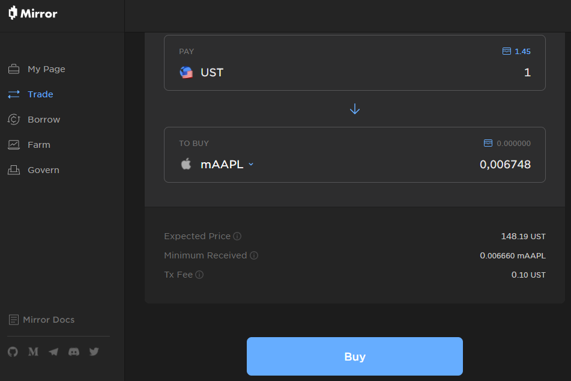
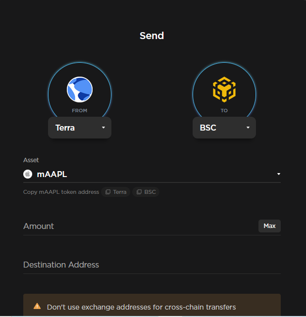
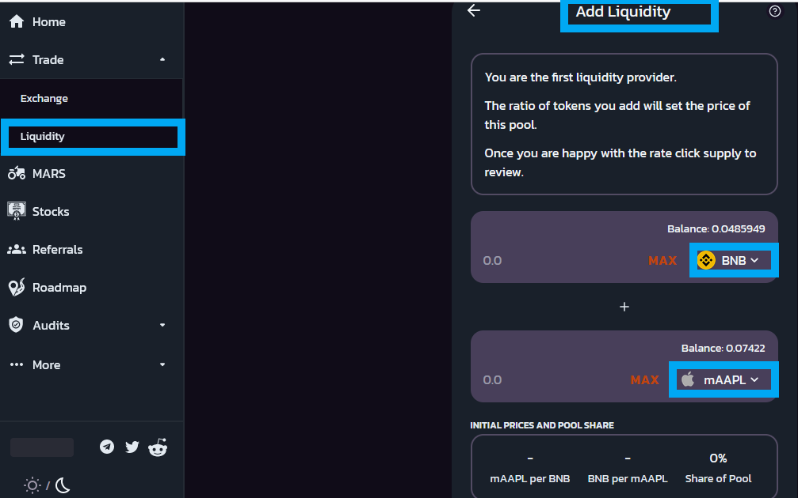

# How to buy stocks?

Step 1: Enter to 1inch.io and purchase UST on the BSC network. \(We recommend using Metamask.\)

Step 2: Download the Terra Wallet \(terra.money\).

Step 3: Use the Terra Bridge to send your USTs from the BSC network to Terra. \([https://bridge.terra.money](https://bridge.terra.money)\)

Step 4: Enter to Mirror.finance on the Terra Webapp to purchase your synthetic tokens.

Step 5: Use the Terra bridge to send your synthetic tokens from the Terra network to BSC. \([https://bridge.terra.money](https://bridge.terra.money)\)

Step 6: Create liquidity from your LP. Go to marsswap.finance - trade - Liquidity - Add Liquidity and choose the two tokens to form your LP.

